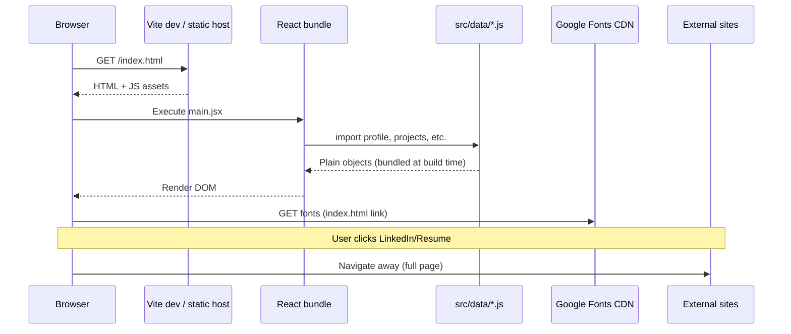

# API & External Data Flow - Quoc Huy (Jimmy) Portfolio

> This project has **no first-party REST/GraphQL API** and **no authentication layer**. It is a static content site. This document describes actual external data flows and what to do if you add a backend later.

## Current architecture: static content



## HTTP client

**Not present.** No `axios`, `fetch` wrappers, or `react-query` in `package.json`.

## “Endpoints” (external only)

| URL | Method | Used by | Purpose |
|-----|--------|---------|---------|
| N/A (bundled modules) | - | All components | Content from `src/data` and project JSX |
| `https://fonts.googleapis.com/...` | GET | `index.html` | Source Sans Pro + Cormorant Garamond |
| `profile.contact.linkedin` | GET (browser navigation) | `Nav.jsx` | User profile |
| `profile.contact.resume` | GET (browser navigation) | `Nav.jsx` | Google Docs resume |
| `/images/*` | GET | Hero, project heroes, personal masonry | Static assets from `public/images/` |
| `/favicon/*` | GET | Browser tabs, pinned shortcuts, mobile home-screen icons | Transparent portrait favicon variants from `public/favicon/` |
| `/og-image.jpg` | GET | Open Graph / Twitter link previews | Social preview image (1200×681 JPEG, ~104 KB) referenced by absolute metadata URLs in `index.html` / `Seo.jsx`. The 2 MB `og-image.png` source still ships but is no longer referenced. |
| `/robots.txt` | GET | Search + AI crawlers | Allows all UAs (incl. GPTBot, ClaudeBot, PerplexityBot) and declares the sitemap |
| `/sitemap.xml` | GET | Search engines | Generated into `dist/` by `scripts/prerender.mjs` from `projects.js` + `blog.js` (24 URLs: EN + `/vi/` pair per page, with `xhtml:link` hreflang annotations) |
| `/llms.txt` | GET | AI engines | Markdown site summary for LLM crawlers |
| `/banners/<slug>.html` | GET (iframe) | `BannerEmbed` on home cards + `ProjectShell` on detail | Self-contained animated banner per project |
| `https://jimmyvu.info/*` | 308/301 redirect | Vercel edge routing | Redirects apex traffic to the canonical `https://www.jimmyvu.info/*` host so www and non-www links expose the same metadata |

Cache headers (`vercel.json`): `/assets/*` 1y immutable, `/hero-banners/*` 1d immutable, `/banners/*` 1h, `/images/*` 1d.

### Image asset paths (static files)

| Path | Referenced in |
|------|----------------|
| `/og-image.jpg` | `index.html` Open Graph and Twitter image metadata as `https://www.jimmyvu.info/og-image.jpg` (default image for `Seo.jsx` too) |
| `/favicon/favicon.ico`, `/favicon/favicon-16x16.png` … `/favicon/favicon-256x256.png` | `index.html` favicon links for desktop browsers |
| `/favicon/apple-touch-icon.png`, `/favicon/android-chrome-192x192.png`, `/favicon/android-chrome-512x512.png`, `/favicon/site.webmanifest` | `index.html` mobile and PWA icon metadata |
| `/images/hero-banners/hero_*.{webp,png}` | `Hero.jsx` - art-directed variants (mobile portrait, mobile landscape, tablet, MacBook 13, FHD, QHD, 4K, ultrawide). **WebP enabled** (`WEBP_ENABLED = true`); `.webp` files (37-97 KB, cwebp -q 80) are served first, `.png` (1.6-5.7 MB) is the fallback. `index.html` preloads the mobile-portrait and FHD `.webp` variants as the LCP image. Regenerate after editing a PNG: `cwebp -q 80 hero_X.png -o hero_X.webp`. |
| `/favicon/favicon*.{ico,png}` + `/favicon/apple-touch-icon.png` + `/favicon/android-chrome-*.{png,webp}` + `/favicon/site.webmanifest` | Wired in `index.html` `<head>` (full favicon set + PWA manifest). `Nav.jsx` also uses `/favicon/favicon-96x96.png` (with 64/128/256 srcSet) as the brand mark in the header. |
| `/images/projects/lending-orchestration-platform.jpg` | `featuredProject.image` |
| `/images/projects/yoohome.jpg` | `otherProjects[0]` |
| `/images/projects/dotmar-cms.jpg` | `otherProjects[1]` |
| `/images/projects/zigbee-gateway-firmware.jpg` | `otherProjects[2]` |
| `/images/projects/hubly.jpg` | `otherProjects[3]` |
| `/images/personal/personal_1.jpeg` … `personal_8.jpeg` | `personal.images[]` (masonry wall, chronological) |

`public/images/projects/` ships 1600×1000 JPEG project thumbnails derived from approved reference screenshots, marketing/product images, or other non-confidential visual assets. `scripts/generate-project-previews.mjs` remains available for producing anonymized placeholder mockups when a project has no approved real-world visual source.

```bash
node scripts/generate-project-previews.mjs --force
```

Blog cover images live under `public/images/blog/<slug>.jpg` and are referenced from `blog.ts` `cover` fields. When the directory is empty, `BlogCard` + `BlogDetailPage` render the bronze gradient fallback automatically.

### Banner asset paths (static HTML, served as iframe documents)

No banner files ship with the current project set; all cards in `src/data/projects.js` have `banner: null` and fall back to image (or the dark fallback panel).

To add a banner: drop `public/banners/<slug>.html` (self-contained doc with the `.banner-fit` 560×510 wrapper + the `--scale` inline script) and set `banner: '/banners/<slug>.html'` on the matching card.

### Lazy-loaded dashboard chunks

`src/embeds/` is empty today. The `EmbedSlot` + `projectEmbeds` wiring is preserved so a future project can add a Claude-artifact-style dashboard with three small edits (registry, lazy import, JSX mount).

## Authentication flow

**Not applicable.** No login, tokens, sessions, or secure storage.

## Error handling (network)

No API error boundaries. Possible runtime issues:

| Scenario | Behavior |
|----------|----------|
| Missing image file | Broken background image (browser 404) |
| Missing banner HTML | iframe shows empty document (cards keep aspect-ratio + dark `--bg-primary` background) |
| Banner JS error inside iframe | Iframe renders at native 560×510 with no scaling; visible black margins on wider containers |
| Missing embed in `EmbedSlot.dashboards` map | `EmbedSlot` silently renders nothing (returns `null`) |
| Invalid project slug | `ProjectPage` pattern removed; unknown routes fall through unless host returns SPA index |
| Missing route in `App.jsx` | Blank or host 404 depending on deployment |

To add a catch-all route, extend `App.jsx`:

```jsx
<Route path="*" element={<Navigate to="/" replace />} />
```

(Currently only defined routes exist; direct URL to unknown path depends on host SPA config.)

## Routing vs “API”

`react-router-dom` handles client-side navigation only:

```javascript
// src/App.jsx - explicit route table
<Route path="/projects/lending-orchestration-platform" element={<LendingPlatformProject />} />
```

No route loaders, no data fetching on navigation.

## Production link previews

`index.html` hard-codes `https://www.jimmyvu.info/` in `canonical`, `og:url`, `og:image`, and Twitter image tags because social crawlers do not run the React bundle and should not depend on relative asset paths. `vercel.json` redirects the apex host `https://jimmyvu.info/*` to `https://www.jimmyvu.info/*`, so sharing either host gives crawlers the same canonical Open Graph metadata.

## Hash-based deep linking (home)

```javascript
// src/pages/HomePage.jsx
useEffect(() => {
  if (!window.location.hash) return
  const id = window.location.hash.replace('#', '')
  document.getElementById(id)?.scrollIntoView({ behavior: 'smooth' })
}, [])
```

Flow: User opens `https://site.com/#work` → Home mounts → scrolls to `#work`.

## If you add a real API later (recommended pattern)

This repo does not implement the following; use as migration guide:

```
src/
  api/
    client.js          # fetch wrapper, base URL from import.meta.env
    endpoints.js       # path constants
  services/
    portfolioService.js
  hooks/
    useProjects.js     # optional react-query
```

### Suggested env vars (Vite)

```bash
# .env.local (not committed)
VITE_API_BASE_URL=https://api.example.com
```

Access via `import.meta.env.VITE_API_BASE_URL`.

### Token handling (if auth added)

Not in scope today. Would typically use:
- HttpOnly cookies (preferred for web), or
- Bearer token in memory + refresh flow

Do not store secrets in `src/data/*` - those files are public in the bundle.

## Third-party services summary

| Service | Data sent | Privacy note |
|---------|-----------|--------------|
| Google Fonts | IP, referrer | CDN request from visitor browser |
| LinkedIn / Google Docs | Standard referrer when user clicks | Leaves site |

## CMS / headless content (future)

To avoid redeploying for copy changes, consider:
- Contentful / Sanity / markdown in repo
- Build-time fetch in `vite.config.js`

Current design optimizes for **simplicity and full design control per project page**.
